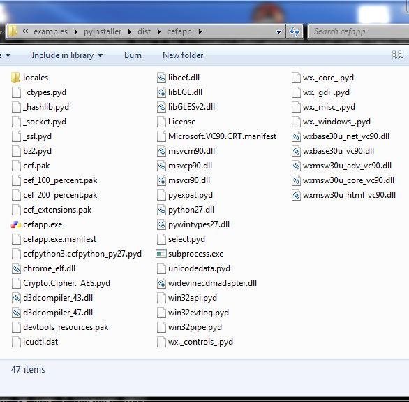
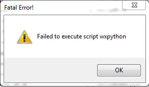

# PyInstaller example

Table of contents:
* [Package app](#package-app)
* [When it succeeds](#when-it-succeeds)
* [Fatal error](#fatal-error)
* [Debug app](#debug-app)
* [More details](#more-details)


## Package app

This is an example of using [PyInstaller](http://www.pyinstaller.org/)
packager to build executable from one of CEF Python's examples
(wxpython.py). Only Windows platform is currently supported.

To install required packages type:
```
pip install --upgrade pyinstaller pycrypto
```

Note that pyinstaller version on PyPI is almost one year old (as of Sep 2017)
and has several bugs, so if you encounter any issues try installing dev
version using this command:
```
pip install https://github.com/pyinstaller/pyinstaller/archive/develop.zip
```

To package the example go to the [examples/pyinstaller/](./) directory
and type:
```
python pyinstaller.py
```


## When it succeeds

If packaging succeeds you should see "dist/cefapp/" directory open
in explorer on Windows. In there you will find "cefapp.exe" executable
that you can launch.




## Fatal error

If there is a "Fatal Error!" message box appearing when running app
then see the next section for how to debug app.




## Debug app

In case of a fatal error to debug app pass "--debug" flag when
packaging app:

```
python pyinstaller.py --debug
```

After packaging completes on Windows it will open a new CMD window
and run the cefapp.exe inside it. You should see detailed logs
in console like these:

```
[6708] PyInstaller Bootloader 3.x
[6708] LOADER: executable is \examples\pyinstaller\dist\cefapp\cefapp.exe
[6708] LOADER: homepath is \examples\pyinstaller\dist\cefapp
[6708] LOADER: _MEIPASS2 is NULL
[6708] LOADER: archivename is \examples\pyinstaller\dist\cefapp\cefapp.exe
[6708] LOADER: No need to extract files to run; setting extractionpath to homepath
[6708] LOADER: SetDllDirectory(\examples\pyinstaller\dist\cefapp)
[6708] LOADER: Already in the child - running user's code.
[6708] LOADER: Python library: \examples\pyinstaller\dist\cefapp\python27.dll
[6708] LOADER: Loaded functions from Python library.
[6708] LOADER: Manipulating environment (sys.path, sys.prefix)
[6708] LOADER: sys.prefix is C:\github\CEFPYT~2\examples\PYINST~1\dist\cefapp
[6708] LOADER: Setting runtime options
[6708] LOADER: Initializing python
[6708] LOADER: Overriding Python's sys.path
[6708] LOADER: Post-init sys.path is \examples\pyinstaller\dist\cefapp
[6708] LOADER: Setting sys.argv
[6708] LOADER: setting sys._MEIPASS
[6708] LOADER: importing modules from CArchive
[6708] LOADER: extracted pyimod00_crypto_key
[6708] LOADER: callfunction returned...
[6708] LOADER: extracted struct
[6708] LOADER: callfunction returned...
[6708] LOADER: extracted pyimod01_os_path
[6708] LOADER: callfunction returned...
[6708] LOADER: extracted pyimod02_archive
[6708] LOADER: callfunction returned...
[6708] LOADER: extracted pyimod03_importers
[6708] LOADER: callfunction returned...
[6708] LOADER: Installing PYZ archive with Python modules.
[6708] LOADER: PYZ archive: out00-PYZ.pyz
[6708] LOADER: Running pyiboot01_bootstrap.py
[6708] LOADER: Running wxpython.py
Traceback (most recent call last):
  File "wxpython.py", line 11, in <module>
  File "c:\python27\lib\site-packages\PyInstaller-3.3-py2.7.egg\
       PyInstaller\loader\pyimod03_importers.py", line 396,
       in load_module exec(bytecode, module.__dict__)
  File "site-packages\cefpython3\__init__.py", line 50, in <module>
  File "c:\python27\lib\site-packages\PyInstaller-3.3-py2.7.egg\
       PyInstaller\loader\pyimod03_importers.py", line 687,
       in load_module module = imp.load_module(fullname, fp, filename,
                                               ext_tuple)
  File "cefpython_py27.pyx", line 283, in init cefpython_py27
       (cefpython_py27.cpp:110881)
ImportError: No module named json
[6708] Failed to execute script wxpython
[6708] LOADER: OK.
[6708] LOADER: Cleaning up Python interpreter.
```


## More details

The corresponding issue in the tracker is [Issue #135](https://github.com/cztomczak/cefpython/issues/135).

See also the [Build executable](https://github.com/cztomczak/cefpython/blob/master/docs/Tutorial.md#build-executable)
section in Tutorial.
